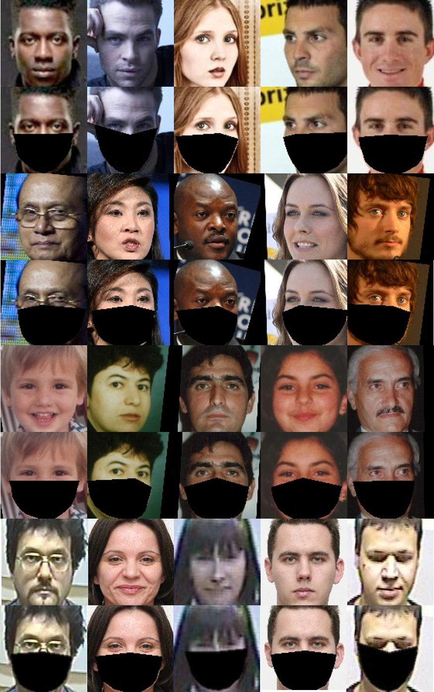
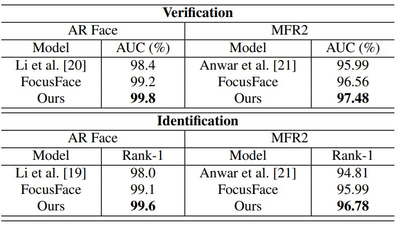

# Face_Mask_Generator

Overview:
--
The code can add on a synthetic mask to each face in a dataset, offering an efficient solution to the lack of facial mask databases. This solution is helpful to the studies on face detection and recognition against facial masks.

Result:
--
<p align="left"></p>

Pre-requisites:
--
- Python3
- Opencv
- Pandas

How to use:
--
1. Clone the Repository to preserve Directory Structure.
2. In **/sample/** directory, we provide 3 images to test the mask generator.
3. In **/landmark/test.csv**, we provide the 68 landmarks and face types for 3 samples. 
4. To generate the masks for samples, run the following commands:
```python make_mask.py ```


```bash
Definition of the face types : 

Example : 0_1 
The first number "0" means the facial image is frontal and "1" means the facial image is profile.
The second number "0" means the facial image is clear and "1" means the facial image is blur.
```

Relative work:
--
Several approaches have been proposed recently. Zheng et al. propose a weakly supervised meta-learning approach to learn from the images collected from the web without manual annotation along with limited fully annotated datasets. They capitalize on readily-available web images with noisy annotations to learn a robust representation for masked faces. Both the spatial and frequency domain features extracted from the unoccluded facial parts are considered. Li et al. propose a framework composed of a de-occlusion network and a distillation network. The former uses a generative adversarial network to recover the facial region under the mask. The latter takes a pretrained face recognition model as a teacher to train the former as a student for improving the performance of de-occlusion. The knowledge to train the student is represented in structural relations and serves as a posterior regularization to enable the adaptation. The approach proposed by Li et al. integrates a cropping-based approach with a convolutional block attention module that focuses on the region around the eyes. FocusFace is composed of two distinct components designed to work together. First, the solution delves into a multi-task learning approach so that the network becomes aware of the existence of a face mask. Secondly, mask awareness promotes a more stable learning of a contrastive loss between the features of both masked and unmasked images. Two training and testing scenarios are considered and mutually improve the performance of each other. Using facial landmarks, Anwar and Raychowdhury make an open-source tool, MaskTheFace, to synthesize masks for transforming general faces to masked faces. The performance of training on synthesized masked faces is verified on a small-sized customized dataset, the MFR2. We also consider the MFR2 in our experiments. 

Result:
--
Performance on the AR Face database, MFR2 database.
<p align="left"></p>

Citation:
--
```
```

Please feel free to contact us if you have any questions. Prof. Gee-Sern Jison Hsu e-mail: jison@mail.ntust.edu.tw
